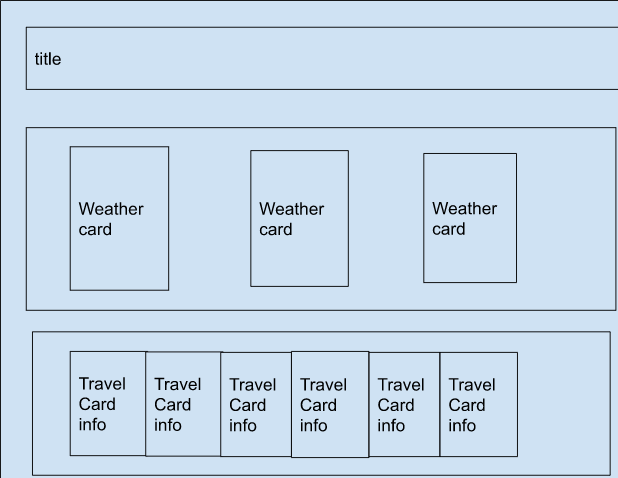
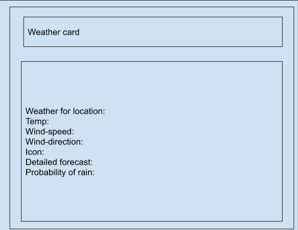
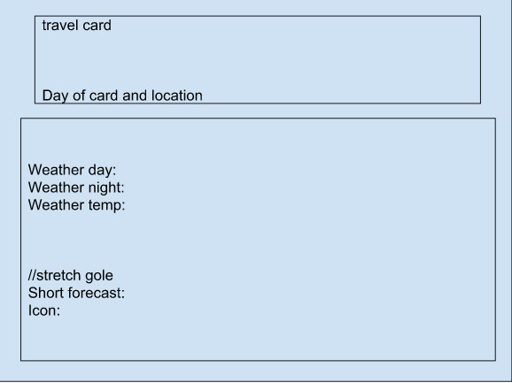

# weather-travel-guide-frontend


### node list

- axios

- react-bootstrap

- Install project with
    ```bash
        npm i
    ```
### instruction for running

1. For this you will need two terminals open. in one terminal cd into the weather-travel-guide-Backend and in the other cd into weather-travel-guide-fronten

2. In the weather-travel-guide-Backend terminal after you have run npm i to install all the things you will need for the computer to run this run nodemon. you will need to do this in the weather-travel-guide-Backend first as the back end will need to be running on localhost:3000. if on deployment your backend crashes make sure you're running the latest version of node and run nodemon again. When your terminal is connected to mongoDB you are connected and ready to continue.

3. In the weather-travel-guide-front after you have run npm i to install all the things you will need for the computer to run this rum npm start. After running npm start it will ask you if it can run on localhost:3001 pres y for yes and react will open the new page for you. When the console for the front end reads connected, you are ready to explore the app.

### Team colaborators 

- Elijah Early

- Larry Yang

- Bailey Rechkemmer

### live link

- 

### Wire Framework





### Notes fgor latter

- this app is a trip planer that allows the user to save the wether for the days they will be in a location. as of now it is pulling from a 3rd part api for the wether info in the area as well as pulling from an additional 3rd party api for translating the city name in to latitude and longitude cordanance. the user can see the forecast for the week and select wether cards to add the the trip box as well as add and change plans and delete cards as needed. we would like to add      if we had more time. in the future we would like to add       to the website 

### stretch goal user storyies

- 

- 

- 

- 

### live link

- https://weather-travel-guide-frontend.onrender.com/ 